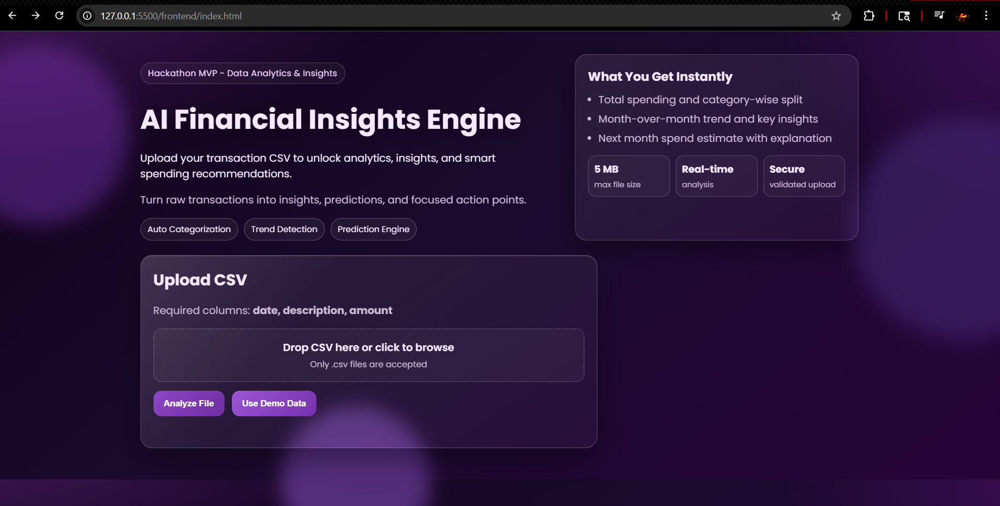
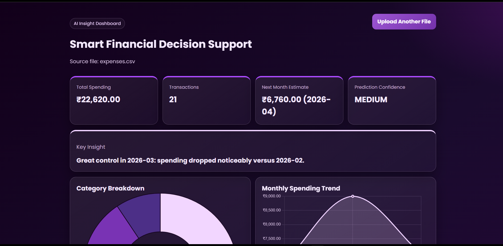
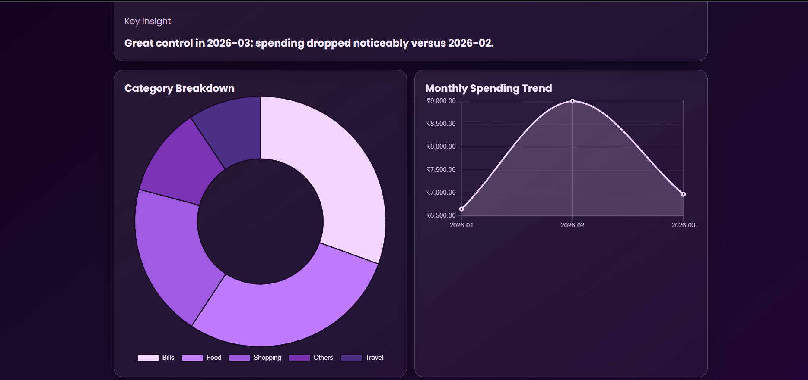

# AI Financial Insights Engine for Smart Decision Making

An end-to-end full-stack system that transforms raw financial transaction data into actionable insights, spending analytics, and next-month predictions to support smarter financial decisions.

This project is designed to:
- Convert raw transaction CSV data into structured analytics
- Help users understand spending behavior clearly
- Provide insight-led support for better financial planning

## 🚀 Live Demo

🔗 https://ai-financial-insights-engine.onrender.com/

> Upload a CSV file to see real-time financial insights and analytics.

## 📸 Screenshots





## 🧩 Features

- Upload CSV file
- Automatic CSV parsing
- Expense categorization
- Category-wise analytics
- Monthly trend analysis
- Human-readable insight generation
- Next-month spending prediction
- Error handling for invalid/empty data
- Demo dataset support (`/api/demo`)

### ⚙️ Tech Stack

#### Frontend
- HTML
- CSS
- JavaScript
- Chart.js

#### Backend
- Node.js
- Express
- Multer (file upload)
- csv-parser

#### Data & Security
- Rule-based categorization and analytics
- CSV parsing with validation
- Input validation for date/amount
- XSS-safe frontend rendering (`textContent`)
- Strict file validation (`.csv` + `text/csv`)

### 📈 Output
After upload, the user sees:
- **Total Spending**
- **Transaction Count**
- **Category Breakdown** (Chart.js doughnut chart)
- **Monthly Trend** (Chart.js line chart)
- **Generated Insights** (human-readable recommendations)
- **Prediction** (next-month estimate + explanation)
- **Recent Transactions** table

### 🧠 Key Highlights
- ✅ End-to-end working full-stack pipeline
- ✅ Handles invalid rows and edge-case CSV input gracefully
- ✅ Secure upload and rendering practices
- ✅ Clean UX with real-time analysis flow
- ✅ Practical, hackathon-ready decision-support MVP

## 🏗️ Architecture
```text
+------------------+       +------------------------+       +------------------------+
|      User        | ----> |  Frontend (HTML/CSS/JS)| ----> |  Backend API (Express) |
+------------------+       +------------------------+       +------------------------+
                                                                      |
                                                                      v
                                                           +------------------------+
                                                           | CSV Validation & Parse |
                                                           +------------------------+
                                                                      |
                                                                      v
                                                           +------------------------+
                                                           | Categorization Engine  |
                                                           +------------------------+
                                                                      |
                                                                      v
                                                           +------------------------+
                                                           | Analytics + Insights   |
                                                           | + Prediction           |
                                                           +------------------------+
                                                                      |
                                                                      v
                                                           +------------------------+
                                                           | Dashboard Rendering    |
                                                           +------------------------+
```

## 🔄 How It Works
1. User uploads a CSV file from the UI.
2. Backend validates file type, size, and structure.
3. CSV rows are parsed and validated (`date`, `description`, `amount`).
4. Transactions are categorized using keyword rules.
5. Analytics are computed (totals, category split, monthly trend).
6. Human-readable insights are generated.
7. A spending prediction for the next month is calculated.
8. JSON response is rendered on the dashboard (cards, charts, insights, table).

### 🧪 Sample Input (CSV)
```csv
date,description,amount
2026-01-05,Coffee shop,200
2026-01-06,Uber ride,300
2026-02-01,Electricity bill,1000
2026-02-10,Amazon order,500
```

## ▶️ How To Run

### Prerequisites
- Node.js 18+ (recommended)
- npm

### 1) Install dependencies
```bash
npm install
```

### 2) Run the server
```bash
npm start
```

### 3) Open in browser
```text
http://localhost:5000
```

### Optional: Allowed Origins
You can configure CORS origins:
```bash
set CORS_ORIGIN=http://localhost:5000,http://localhost:5500
```

## 🧪 How to Test

1. Upload a sample CSV file  
2. View:
   - Spending breakdown  
   - Insights  
   - Predictions  

> Sample CSV included in repo.

## 🚀 Future Improvements

- AI/ML-based transaction categorization
- Multi-user authentication and profiles
- Database-backed historical tracking
- Advanced forecasting models (seasonality/time-series)
- Downloadable reports (PDF/CSV summaries)


If this project helped or inspired you, feel free to star it and share feedback.
